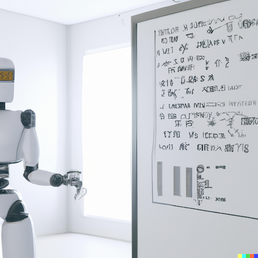

# ng-data-club

Nottingham Psychology data club resources

<figure>

 
<caption>How DALL-E sees our data club</caption>
</figure>

Some materials for the lunchtime (?) *data club*, an informal weekly meeting at the [University of Nottingham](https://www.nottingham.ac.uk/psychology/).

## Aim

>Bring people with varied backgrounds together to talk about, unpack, learn about quantitative methods for data

- organising
- analysing
- visualising

## Ideas for meetings / wishlist

We will try to keep meetings informal with some guided discussion by presenters that will change week by week.

Structure will be around:

1. *I want answer the following question with my data... How do I do that?* and/or
2. *I know the following technique, which could help you with bla...*

## 2022-11-23 - first meeting

- [the slides](./2022-11-23-first-meeting.html) from the first meeting
- [the meeting notes](./2022-11-23-meeting-notes.md) 

## Schedule

| date            | Presenter   | Topic                                                                              |
| --------------- | ----------- | ---------------------------------------------------------------------------------- |
| Wed 23 Nov 2022 | DS/MvR      | Overview, discussion, ideas [[slides](./2022-11-23-first-meeting.html)]            |
| Wed 07 Dec 2022 | Tomas Fiers | `julia`, version control [[slides][julia-slides]]                                  |
| Wed 14 Dec 2022 | MvR         | Linear regression                                                                  |
| Wed 18 Jan 2023 | DS          | Mixing text  + computations,  Markdown, `quarto`, webpages, `pandoc`               |

[julia-slides]: https://raw.githubusercontent.com/schluppeck/ng-data-club/main/presentations/2022-12-07-Julia-for-research.pdf

## Ideas for future meetings

- [some potential, additional ideas](./wishlist.md)
- see also [the meeting notes](./2022-11-23-meeting-notes.md) 

## Colophon

Organised by Mark v Rossum and Denis Schluppeck

**artwork by DALL-E** (https://labs.openai.com/) using the prompt: "a robot performing data analysis reading computer code with mathematic symbols standing in front of a whiteboard photorealistic"
