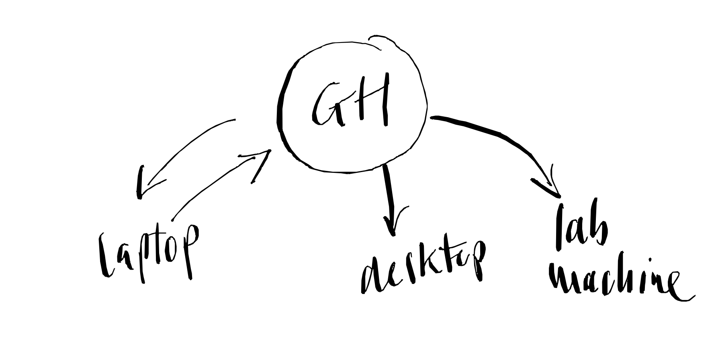
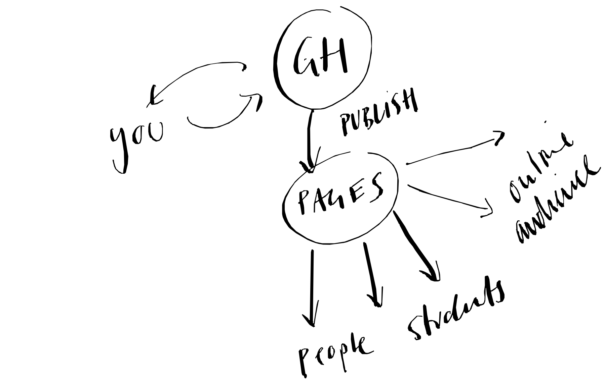

<style>
section::after {
  content: attr(data-marpit-pagination) '/' attr(data-marpit-pagination-total);
  font-weight: bold;
  font-size:24pt;
}
</style>

# Version control with ``git``


##### Denis Schluppeck, 2025-01-14

<br>


---
## Why version control? (*tout seul*)

Lots of good reasons - but the main ones<sup>[1](#myfootnote1)</sup> are:

- a complete **history of changes** (which means you can *undo*)
- **branches** (you can try new stuff out without breaking things)
- you can trace who did what when, **tag** versions of your manuscript / code
	- submitted, published
	- v1.0, feature-release

<br>

<hr>

<a name="myfootnote1"><sup>1</sup></a> see e.g. ["What is version control"](https://www.atlassian.com/git/tutorials/what-is-version-control#benefits-of-version-control)


---
## Why version control? (*avec amis*)

If you are **collaborating** on code / docs, in addition:

- you can trace **who** did **what** and **when** 
- you can **resolve conflicts** (eg two potential fixes to same problem)

## + github.com

- if you use **github.com** lots of additional features 
-  discussions, issues, actions, pages ...


---
## Imagine a typical project (code / notes)

<center>
  <figure>
    
    <hr>
    <figcaption>How material changes over time... </figcaption>
  </figure>
</center>

---
## Why ``git``?

There are many *version control systems* (VCS). But ``git`` comes with some advantages:

- it's **distributed** (full version history in your local copy)
- corollary: you can work with it anywhere :airplane: or :train: (no need for network connection)
- it's widely used<sup>1</sup>

<br>

<hr>

<a name="myfootnote1"><sup>1</sup></a> see e.g. ["Wikipedia / git"](https://en.wikipedia.org/wiki/Git)


---
## ``git`` does snapshots

- think of this as snapshots
- what's the state of each file now?

<center>
  <figure>
    
  </figure>
</center>

---

## How are things tagged?

<center>
  <figure>
    
  </figure>
</center>

<hr>

<small>
	<a name="myfootnote1"><sup>2</sup></a> [CC BY-SA 3.0](https://creativecommons.org/licenses/by-sa/3.0)
</small>


---
## How are things tagged?


- each **file** has a unique *fingerprint* (``shasum``)
- if the file changes, the *fingerprint* changes, too!
- ``sha`` = secure hash algorithm
- ``sha`` turns text/data into a 40 digit hexadecimal number


<hr>

hexadecimal numbers?

<pre>
0...9  10 11 12 13 14   15  # decimal
0...9   a  b  c  d  e    f  # hexadecimal

0 1 10 11 100 101 ...  111  # binary
</pre>
---

## ``shasum`` of a file

```bash
shasum Introduction.md
# b5acbb35abd2511a4c05e48ef58f8990f139793a  Introduction.md
```

<br>

**tiny change, e.g. add a space?!** and calculate SHA again:

<br>


```bash
shasum Introduction.md
# 502bbcb5ab4f0d8127396675dd7d17d7d8b55b0a  Introduction.md
```

... completely different.


---

## `git` nitty-gritty – for data club 😀 

the `sha` actually refers to the 

```
"blob + <size in bytes> + \0 + <the file contents>"
```

you can try this out by

```bash
echo 'Hello, World!' | git hash-object --stdin
# leads to
8ab686eafeb1f44702738c8b0f24f2567c36da6d
```

**Note:** the filename doesn't contribute to the `sha` of the file / blob ... which means renaming files is cheap (doesn't use up space)

---

## How are things tagged (2)?

A similar trick works for a list of directory contents (the "tree")

:arrow_right: **tree hash**

<br>

```code
.
├── analysis
├── stimulusCode
│   └── stims
│       ├── houses
│       ├── normal
│       ├── objects
│       └── scrambled
└── unix-intro
```

---

## How are things tagged (3)? - ``commit``

- information about files (aka **blobs**), their relationship to each other (the **tree**), the previous state (**parent**) and a message make up a ``commit``

<br>

<small>

```bash
$ git cat-file -p HEAD

tree 80fc45cae348efbdbbb652642cf4c22e1ddaaf80
parent b2b3a018fa2569bc5aa54b0b744145f6758bcba7
author Denis Schluppeck <denis.schluppeck@gmail.com> 1517238320 +0000
committer Denis Schluppeck <denis.schluppeck@gmail.com> 1517238320 +0000

fixes http to https
```

</small>

---

## Workflow


<center>
  <figure>
    
    <figcaption>Files </figcaption>
  </figure>
</center>


---
## 3 scenarios to get us all thinking

1. you (on your own), several different computers

2. you, a couple of collaborators,+ code that changes a lot

3. you want to share materials with lots of people (details change: maybe once a year, maybe more often...)


---


---

<center>



</center>

<small>

- **new idea / analysis**: worth creating a new repo (**private??**)

- **on laptop:** work on code, `git add`, `git commit`, `git push` 

- **on desktop:** `git clone`, use code (but if you find a bug while running on lab machine ... <br>fix and push back to repo)

</small>

---


---
## Branches - trying out new ideas
<center>


</center>

<small>


- **colleague and phd student:** want to try some new approach that might break things...

```bash
# they should make a new TRACKING BRANCH
git checkout -b whacky-idea-branch

# work on there, git add  / commit / push...
git checkout main
git merge whacky-idea branch # when ready ;)
```

</small>


---


---
## Pages - sharing via static www hosting
<center>



</center>

<small>

- work on `markdown` (which gets converted to HTML via `jekyll`)
- or use HTML / javascript / anything that is client/browser only ("static") should work
</small>

---
## Examples

- NG data club website is hosted this way: <https://schluppeck.github.io/ng-data-club/>
- [r in browser](./r-in-browser.html)
---


## Local repo: Let's try it

- make a directory, ``cd`` into it
- initialize repo

```bash
mkdir test && cd test
git init
```
- make a text file  ``test.txt``
- write something into it and save it

---

## Let's try it (2)

- add to staging area
- ... and try to commit with a message (``-m``)

```bash
git add test.txt
git commit -m 'my first commit'
```
---

## Warnings?

- you'll see some warning messages
- for (only this first time), set up your ``user.name`` and ``user.email``

```bash
git config --global user.name "First Last"    # your name
git config --global user.email "me@gmail.com" #  your email
```

- This info is stored on your machine in a little file, which you can inspect )e.g. on `macos` 

```
more ~/.gitconfig
```

---

## Now complete the commit

```bash
git status # read what's there

git commit -m 'my first commit'

git status # read what's there NOW
```

---

## If you want this on github

Currently the repository is local to the machine you are working on, if you want to share with your friends and colleagues on ``github.com``, follow instructions at:

https://help.github.com/en/articles/adding-an-existing-project-to-github-using-the-command-line


---
## Notes

- Illustrations linked from https://git-scm.com/book/en/v2/ - Creative Commons license [CC BY-NC-SA 3.0](https://creativecommons.org/licenses/by-nc-sa/3.0/)

- Details on ``shasum`` (available as a UNIX command):
```bash
man shasum  # or
info shasum
```
