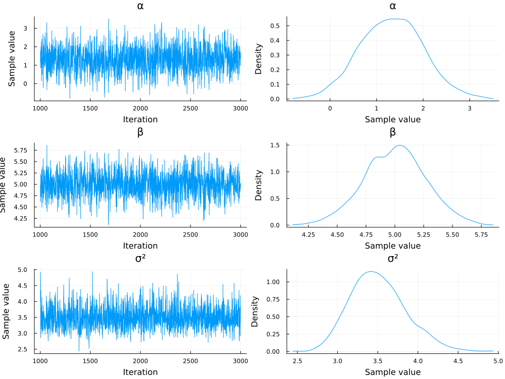
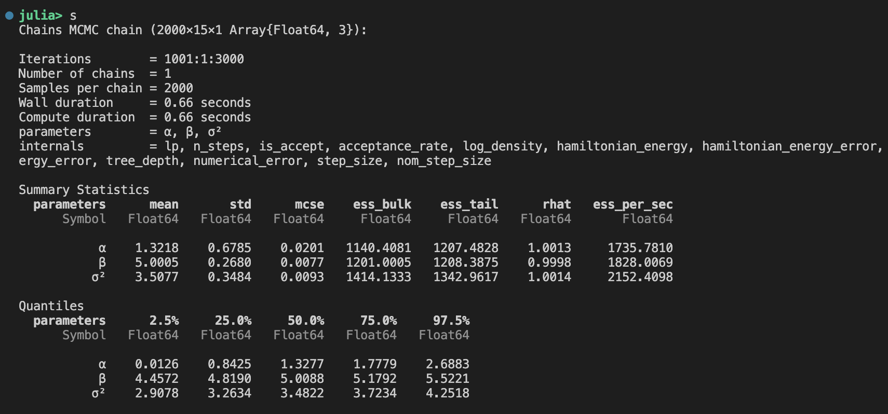

## Basics

The *posterior distribution* of the parameter(s) $\theta$ is the product of the *likelihood of the data (given the parameters) and the *prior* of the parameter divided by a normalising term.

$$
p(\theta \mid \mathcal{D}) = \frac{p( \mathcal{D} \mid \theta) p(\theta)}{p( \mathcal{D})}
$$

where 

- $p(\theta \mid \mathcal{D})$ is the posterior
- $p( \mathcal{D} \mid \theta)$, the likelihood
- $p(\theta)$, the prior and 
- $p(\mathcal{D})$, a normalising term, summing over $p(\mathcal{D} \mid \theta ) p(\theta )$ for all possible values of $p(\theta)$
  
## Notes on MvR's presentation

## Python, `PyMC`

You can learn about `PyMC` and Bayesian Modelling on [the project website](https://www.pymc.io/projects/docs/en/latest/installation.html).

## Julia, `Turing.jl`

If you prefer `julia`, you can dig into the following package, which looks very mature: https://turinglang.org/ (eg Zoubin Ghahramani is [on the team for this project 😎](https://turinglang.org/team/))

For a #julialang-tinged introduction into Bayesian Inference, watch a [presentation on `Turing.jl`](https://www.youtube.com/watch?v=UvY-HD-7GVc).

I have also had a play around with a linear regression example, which is not a huge jump for Matlab users and is easy to translate from model spec equations to code!

[Julia example code](./linreg_example.jl).

Nice diagnostic plots out of the box

... and nice display tables for values for the MCMC diagnostics and summaries:

## Reading

- the [Bishop book on Pattern Recognition and Machine learning](https://www.microsoft.com/en-us/research/uploads/prod/2006/01/Bishop-Pattern-Recognition-and-Machine-Learning-2006.pdf) - online PDF for @bishop2007

- A podcast / interview (The Life Scientific) with Adrian Smith [The power of Bayesian Statistics](https://www.bbc.co.uk/programmes/m001hwwl). Interesting background.

- An extensive article @gelman2020bayesianworkflow on [a Bayesian Workflow](https://arxiv.org/pdf/2011.01808).
